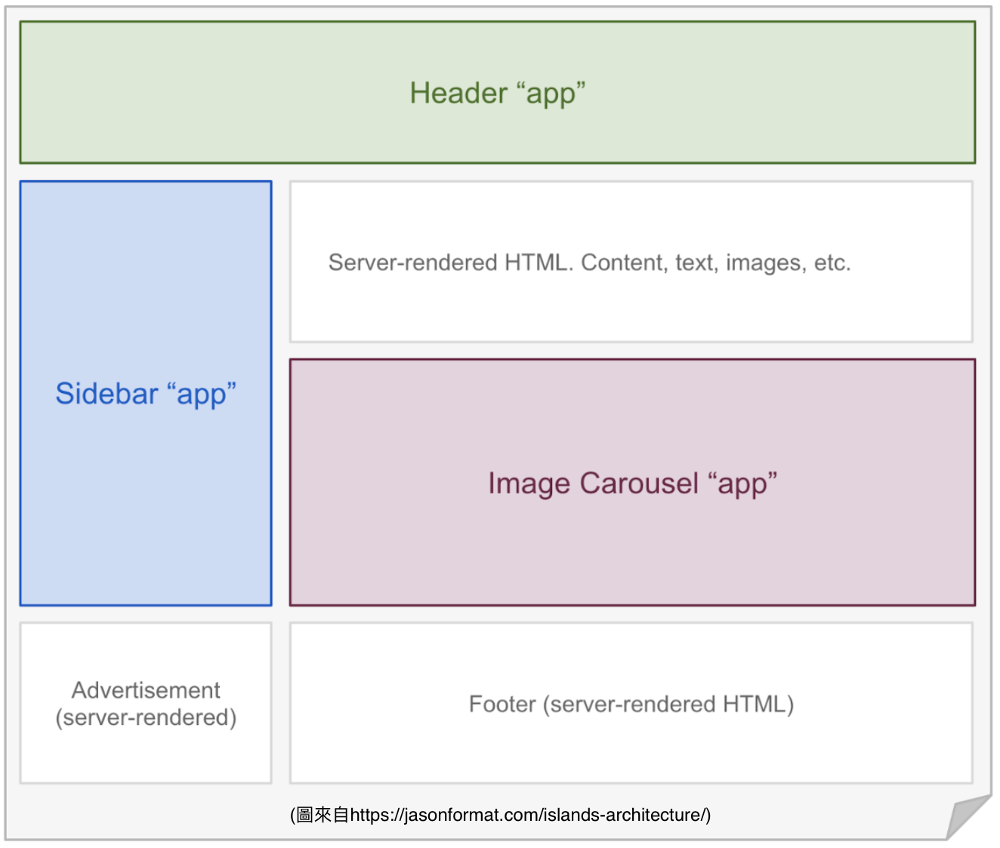

# Islands Architecture

## 起源

Islands Architecture孤岛架构最初是由Etsy的前端架构师Katie Sylor-Miller在2019年提出，并由Preact作者Jason Miller在[islands-architecture](https://jasonformat.com/islands-architecture/)一文中推广。这是一套基于SSR（服务端渲染）的架构。

传统SSR，首屏渲染时，服务端会向浏览器输出HTML结构。当浏览器渲染HTML后，再执行前端框架的初始化逻辑，为HTML结构绑定事件，这一步叫hydrate。当hydrate完成后，页面才能响应用户交互。也就是说，只有当整个页面所有组件hydrate完成后，页面中任一组件才能响应用户交互。如果使用Chrome LightHouse进行性能分析，跑分中的TTI（Time to Interactive，可交互时间）指标可能不尽如人意，甚至会因为首屏渲染时间过长而影响用户体验。

Islands Architecture主要解决SSR with hydrate TTI过高的问题。

## 原理

Islands Architecture的核心思想是将页面拆分为多个独立的组件，每个组件都可以独立地进行SSR和hydrate。当用户访问页面时，服务端会先渲染出页面的骨架结构，然后将每个组件的HTML结构和JavaScript代码发送给浏览器。浏览器接收到这些数据后，先渲染骨架结构，然后异步地加载每个组件的JavaScript代码并执行hydrate。这样，用户就可以在页面骨架结构渲染完成后立即开始与页面交互，而不需要等待整个页面所有组件都hydrate完成。

在Islands Architecture下，会把组件分为动态交互组件和静态组件：
- 动态交互组件
- 静态组件



首屏静态组件包括Content、Advertisement、Footer；动态交互组件包括Header、Sliderbar、Image Carousel。静态组件会像传统SSR一样向浏览器输出HTML，而交互组件会在浏览器异步、并发渲染。

每个动态组件都是独立的，各做各的hydrate而不会相互影响。既然同时存在动态与静态元件那server side生成的时候该怎么去做分别？ 其实Islands Architecture的框架会透过『占位符』(placeholders/slots）的方式预先留好插入动态元件的地方，接着在client-side各别同时做partial hydration。

Islands Architecture合适的场景还是适用于以静态内容为主的网站，在少数需要做交互的地方插入独立的动态元件，如果是大量交互需要的web应用反而就不合适这种作法。

总结一下：
- 性能佳且包含所有SSR & SSG的优点。 减少非常多需要发送的client side的JS仅需要加载有交互的组件部分，使得画面载入能更快速以及获得更好的TTI指标。
- 不合适大量需要交互的应用，会切出过多的Island components导致交互出现问题
- 目前实作Island Architecture的框架还不多

## 实现

Islands Architecture的实现需要前端框架的支持。目前，Preact和React都提供了对Islands Architecture的支持。在Preact中，可以使用`preact-islands`库来实现Islands Architecture。在React中，可以使用`react-islands`库来实现Islands Architecture。

## 示例

以下是一个简单的Islands Architecture示例：

```jsx
import { h, render } from 'preact';
import { hydrate } from 'preact-islands';

function App() {
  return (
    <div>
      <h1>Hello, World!</h1>
      <Counter />
    </div>
  );
}

function Counter() {
  const [count, setCount] = useState(0);

  return (
    <div>
      <button onClick={() => setCount(count + 1)}>Increment</button>
      <p>Count: {count}</p>
    </div>
  );
}

hydrate(<App />, document.getElementById('root'));
```


参考链接：
 [Islands Architecture會為前端帶來什麼樣新的改變嗎](https://kayshih.com/posts/islands-architecture)
