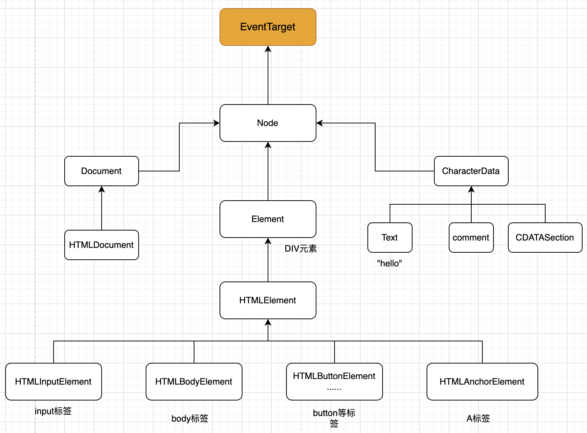

# DOM元素继承关系一览表

## 图形描述

## 描述

- EventTarget，是一切的根的顶级接口，支持addEventListener、removeEventListener和dispatchEvent方法注册、删除和分发事件。

- Node，是一个抽象类，其他DOM节点都继承它。

它提供了树的核心功能：parentNode，nextSibling，childNodes，previousSibling，firstChild，lastChild 等。Node类的对象从未被创建。但是还有一些继承自它的其他类（因此继承了 Node 的功能）。

- Document 由于历史原因通常被 HTMLDocument 继承（尽管最新的规范没有规定。

全局变量 document 就是属于这个类。它作为 DOM 的入口。

- CharacterData —— 一个“抽象”类，被下述类继承：

Text —— 对应于元素内部文本的类，例如 `
Hello
 `中的 Hello。

Comment —— 注释类。它们不会被展示出来，但每个注释都会成为 DOM 中的一员。

CDATASection —— CDATA 节点，例如` <![CDATA[...]]>`。

- Element —— 是 DOM 元素的基础类。

它提供了元素级导航（navigation）, 如 nextElementSibling，children，以及搜索方法，如 getElementsByTagName 和 querySelector。

浏览器不仅支持 HTML，还支持 XML 和 SVG。因此，Element 类充当的是更具体的类的基础：SVGElement，XMLElement（我们在这里不需要它）和 HTMLElement。

- HTMLElement —— 是所有 HTML 元素的基础类。我们大部分时候都会用到它。

它会被更具体的 HTML 元素继承：

HTMLInputElement —— input 元素的类

HTMLBodyElement —— body 元素的类

HTMLAnchorElement —— a 元素的类

HTMLCanvasElement —— canvas 元素的类

HTMLImageElement —— img 元素的类

HTMLVideoElement —— video 元素的类

还有更多的可以参考[这里](https://developer.mozilla.org/en-US/docs/Web/API)

## 规范

[EventTarget](https://dom.spec.whatwg.org/#interface-eventtarget)

[Document](https://dom.spec.whatwg.org/#interface-document)

[Node](https://dom.spec.whatwg.org/#interface-node)

[HTMLElement](https://dom.spec.whatwg.org/#interface-htmlelement)

[HTMLInputElement](https://dom.spec.whatwg.org/#interface-htmlinputelement)
