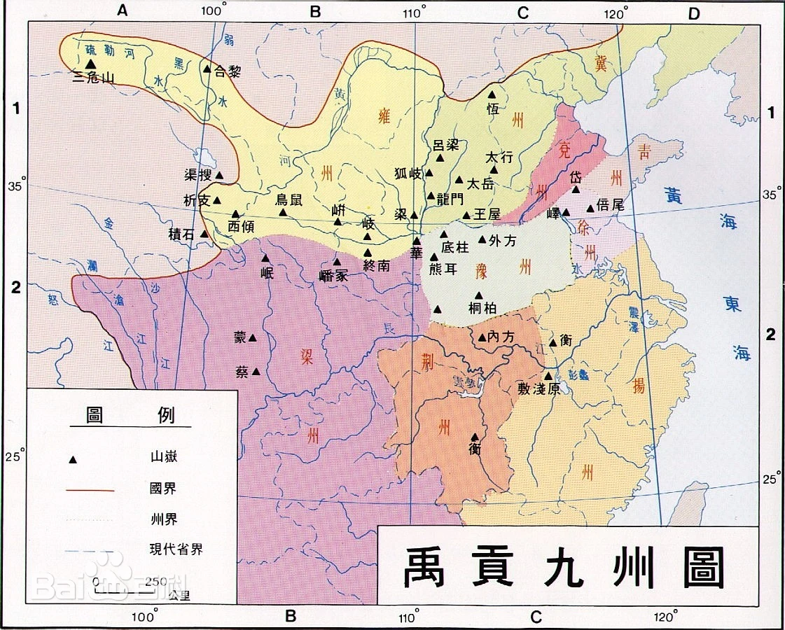

## 夏商周
约公元前2070-公元前771年

## 夏
禹禅让帝位给伯益，禹的儿子启夺位称帝，建立了中国第一个奴隶制国家——夏，自此世袭制取代了禅让制。

## 第一个亡国君主-夏桀
夏王朝第16代君王“桀（jie）”是历史上有名的暴君，据《竹书纪年》记载，他“筑倾宫、饰瑶台、作琼室、立玉门”。夏桀还有许多尽人皆知的暴政，如放饿虎于市中，欣赏人们惊恐逃命的样子。
> 倾宫就是一种高大、宏丽的建筑
夏桀重用奸臣，排挤贤臣。他重用一个叫赵梁的小人，此人专投桀所好，教他如何享乐，如何勒索、残杀百姓。伊尹以尧、舜的仁政来劝说桀，不听，随去。

## 禹贡九州
禹在位时，把天下划分为九州，即冀州、兖州、青州、徐州、扬州、荆州、豫州、梁州、雍州。九州的划分，为后来的行政区划奠定了基础。

## 九鼎
大禹在建立夏朝以后，用天下九牧所贡之铜铸成九鼎，象征九州，九州的名山大川奇物都刻在九鼎上；商汤逐走夏桀后，将九鼎迁至其都。盘庚定都于殷后，九鼎迁移至此，周朝又继承了九鼎，九鼎成为夏、商、周三个朝代的象征。

## 伊尹囚帝

伊尹是商王朝的开国功臣，也是中国第一位贤臣，杰出的政治家、思想家，道家学派创始人之一、也被尊为**中华厨祖**。历史上被视为臣道的楷模，

太甲继位时，因年纪太小，伊尹既是摄政大臣又是太甲的老师。而太甲则暴虐、昏庸、道德败坏，不遵守商汤制定的大政方针。伊尹为了教育太甲，将太甲流放到桐宫，桐宫就是商汤的陵寝。伊尹与诸大臣代为执政，并著《伊训》、《肆命》《徂后》等训词，讲何事可为、何事不可为以及治理国家之事。

太甲在桐宫三年，深刻反省，改过自新，伊尹亲自到桐宫迎接，并还政太甲，自己仍为摄政。太甲勤于政务，施行德政，终成一代明君。

## 《周易》
《周易》是中国古代典籍中的一部重要著作，是中国古代哲学、文化、历史、文学、艺术等领域的经典之一，被誉为“群经之首，大道之源”。
姬昌，后人尊称周文王，著有《周易》，将八卦演为64卦，并做卦辞、辞。
